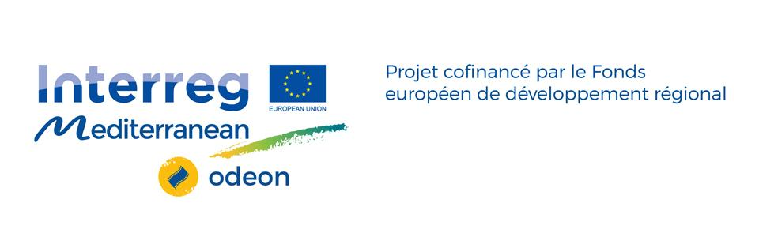

Après le succès des [Open Data Days](https://datactivist.coop/opendatadays/) qui se sont tenus du 4 au 6 mars 2020 à Marseille, l'Agence des villes et territoires méditerraneéns durables ([Avitem](https://www.avitem.org/)) et [Datactivist](https://www.datactivist.coop) ont décidé de prolonger ces échanges autour de l'impact des données ouvertes initiés dans le cadre du [projet européen ODEON (Open Data for European Open iNnovation)](https://www.avitem.org/fr/projet/odeon-open-data-european-open-innovation).

Les 20 et 27 mai 2020, Avitem et Datactivist ont organisé et animé deux webinaires thématiques dans le prolongement de ces journées. Vous retrouverez les liens vers vidéos, la documentation et le présentation de ces événements dans le tableau ci-dessous :

***

# Documentation

| Date | Titre | Intervant·es | Vidéo | Présentations
| :---: | :--- | :---: | :--- | :---|
| `20-05-2020` | [*30 formats collaboratifs pour explorer les données*](http://datactivist.coop/webinaires_odeon/webinaire_ODEON_exploration) | Charles Népote ([OpenFoodFacts](https://fr.openfoodfacts.org/)) | [Webinaire ODEON #1](https://aperi.tube/videos/watch/33c1d132-8d0b-40b8-8403-b4c9c9c42933) (1h29'21") | [support](https://docs.google.com/presentation/d/15WgFg3fhysYDVE2WOhBfHuIiTRgLzndOn8nnky1x5Ks/edit#slide=id.g288e48084b_0_0) |
| `27-05-2020` | [*La standardisation des données locales en quatre projets*](http://datactivist.coop/webinaires_odeon/webinaire_ODEON_standardisation) | Miryad Ali ([Dinum](https://numerique.gouv.fr/))   Jean-Marie Bourgogne ([OpenDataFrance](http://www.opendatafrance.net/))   Alexandre Bulté ([Etalab](https://www.etalab.gouv.fr/))   Pascale Vinot ([ADNtourisme](https://www.adn-tourisme.fr/)) | [Webinaire ODEON #2](https://aperi.tube/videos/watch/d28ee50f-a4cb-42ab-842a-87a86b83aac8) (1h29'00") | [Dossier support](https://github.com/datactivist/webinaires_odeon/tree/master/webinaire_ODEON_standardisation/supports) |
