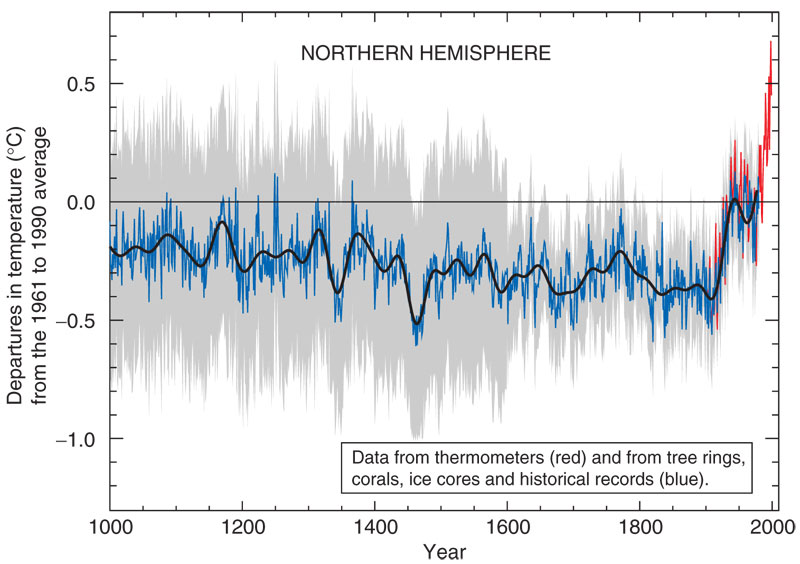
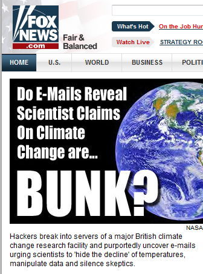
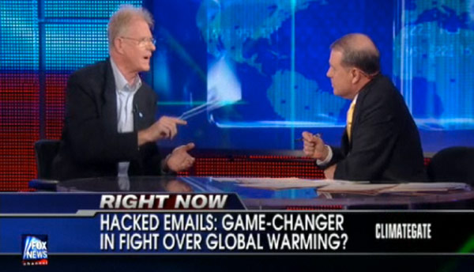
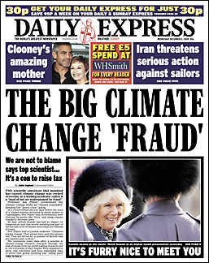
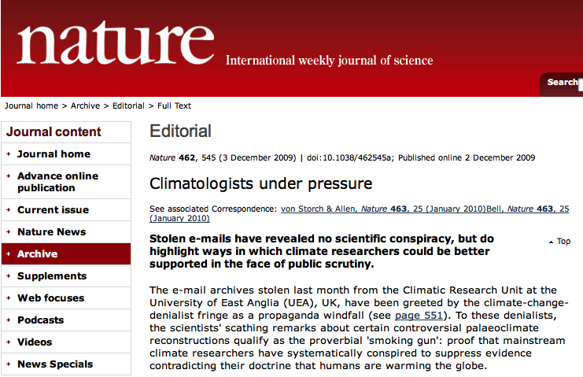
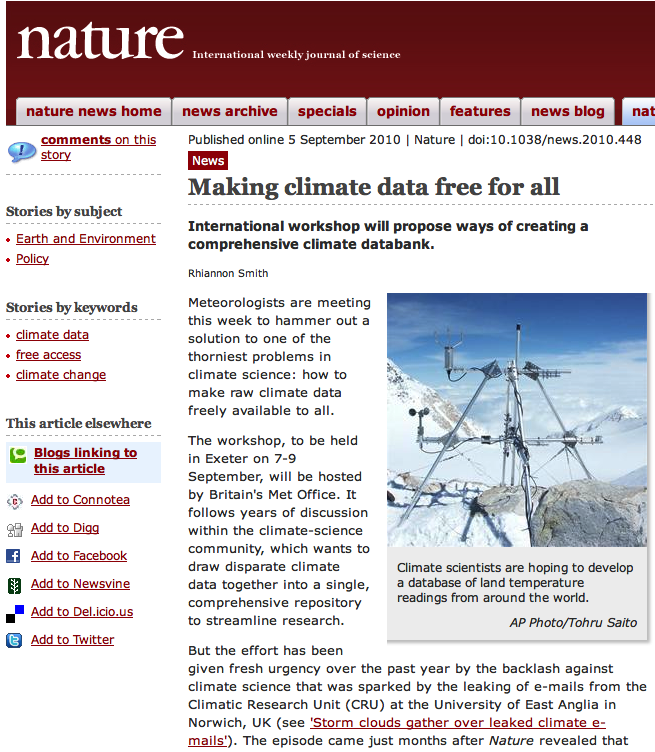
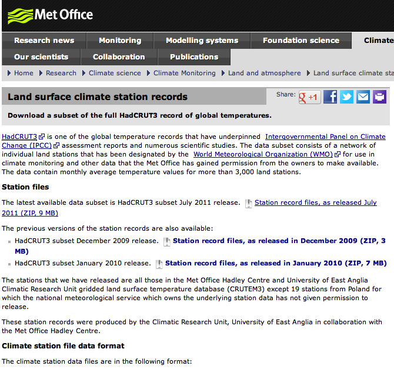

```{r setup, include=FALSE}
knitr::opts_chunk$set(echo = FALSE)
options(knitr.duplicate.label = 'allow')
```


## L'affaire Climategate

.pull-left[
En 2009, mille courriels du Climate Research Unit (UK) sont piratés :
- traitent certains climatologues "sceptiques" avec irrespect
- proposent le boycott d'une revue réputée publier de mauvais travaux 
- décrivent une "astuce" permettant de "cacher la baisse"]

.pull-right[
]

---

## L'affaire Climategate
### L'emballement est immédiat





---

## L'affaire Climategate
### Pourquoi avoir piraté les courriels ?

Les chercheurs du CRU refusaient de partager leurs données et leurs algorithmes.

L'argument utilisé : les données sont collectées de plusieurs sources étrangères (stations météo) et n'appartiennent pas aux chercheurs.

---
## L'affaire Climategate
### Stupeur du côté des climatologues

.reduite.center[]

---

## L'affaire Climategate
### Une fois l'affaire tassée, comment ouvrir les données ?

.reduite.center[]

---

## L'affaire Climategate
### Enfin l'ouverture des données réclamées

.reduite.center[]

---