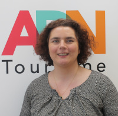

# Webinaire #2 : la standardisation des données locales en quatre projets

----

## Panel  

|[Myriad Ali](https://www.linkedin.com/in/miryad-ali/)|[Jean-Marie Bourgogne](https://www.linkedin.com/in/jbourgogne/)|[Alexandre Bulté](https://www.linkedin.com/in/alexandrebulte/)|[Pascale Vinot](https://www.linkedin.com/in/alexandrebulte/Pascale Vinot)|
|----------------|----------------|----------------|----------------|
|responsable de l'ouverture des données chez transport.data.gouv.fr|délégué général d’OpenDataFrance|directeur Technique Etalab|responsable de projets Tourisme & numérique, DATAtourisme
|||||
|| [@opendata_fr](https://twitter.com/opendata_fr) | [@abulte](https://twitter.com/abulte) | [@pascalevinot](https://twitter.com/pascalevinot)|

--------------

## La vidéo

<iframe width="560" height="315" sandbox="allow-same-origin allow-scripts allow-popups" src="https://aperi.tube/videos/embed/d28ee50f-a4cb-42ab-842a-87a86b83aac8" frameborder="0" allowfullscreen></iframe>

### Déroulé

- à venir - 

-------------

## Documentation

### Les supports

Tous les supports sont disponibles en format PDF dans [le dossier "supports"](https://github.com/datactivist/webinaires_odeon/tree/master/webinaire_ODEON_standardisation/supports) du répertoire de ce webinaire. Vous pouvez également les télécharger en suivant les liens suivants :
* [*Le Point d’accès national aux données de transport*, Myriad Ali](https://github.com/datactivist/webinaires_odeon/blob/master/webinaire_ODEON_standardisation/supports/presentation_transport_gdf.pdf) ;
* [*Normaliser et contrôler les données*, Jean-Marie Bourgogne](https://github.com/datactivist/webinaires_odeon/blob/master/webinaire_ODEON_standardisation/supports/presentation_scdl_validata.pdf) (également disponible en format [Google Presentation](https://docs.google.com/presentation/d/1FyGAzhGHyYfuAFCRTbgki-4yTLZbC_34Y74hTs7RwA8/edit)) ;
* [*DATATourisme, l'information touristique en open data*, Pascale Vinot](https://github.com/datactivist/webinaires_odeon/blob/master/webinaire_ODEON_standardisation/supports/presentation_datatourisme.pdf)
* [*schema.data.gouv.fr*, Alexandre Bulté](https://github.com/datactivist/webinaires_odeon/blob/master/webinaire_ODEON_standardisation/supports/presentation_schema_dgf.pdf)

### Les liens partagés

* [les présentations réalisées dans le cadre des OpenDataDays](https://datactivist.coop/opendatadays), première phase du projet ODEON ;
* [le billet Medium de Datactivist détaillant la méthode Dat'accélère](https://medium.com/datactivist/datacc%C3%A9l%C3%A8re-des-ateliers-et-une-m%C3%A9thodologie-pour-booster-les-projets-avec-les-donn%C3%A9es-9b40776891a4), développée pour dynamiser vos projets grâce aux données ouvertes ;
* [les données des vélos en libre service mises à dispo sur transport.data.gouv.fr](https://transport.data.gouv.fr/datasets?type=bike-sharing), un axe de développement en cours sur la standrdisation des données ;
* [la discussion TeamOpenData sur l'outil Dataproofer](https://teamopendata.org/t/dataproofer-un-outil-de-controle-de-la-qualite-des-donnees/1471), un outil de contrôle de la qualité des données ;
* [un des billets d'Etienne Pichot, de Datactivist, sur la question des données de transport](https://medium.com/datactivist/lopen-data-des-transports-au-royaume-uni-et-en-france-retour-du-workshop-de-l-open-data-ca930c2f7f2) et un autre sur [la production de données GTFS](https://medium.com/datactivist/pourquoi-et-comment-ouvrir-ses-donn%C3%A9es-de-transport-une-m%C3%A9thode-simple-en-3-%C3%A9tapes-d957f5921e57) ;
* [le guide de la création des schémas de données réalisé par Etalab](https://guides.etalab.gouv.fr/producteurs-schemas) à l'intention des producteurs et productrices ;
* [metis](https://schema.data.gouv.fr/metis-reseaux/infos-travaux/latest.html), un des schémas à l'origine de la création du portail schema.data.gouv.fr présenté par Alexandre Bulté ;
* [le repo Github du Service Interface for Vehicle Use (ou Sivu)](https://github.com/CityOfParisInnovationData/service-interface-vehicle-use), le schéma de données utilisé par les opérateurs de mobilité travaillant avec la mairie de Paris ;
* ["Produire un standard open data en 2019 : grands principes et jalons"](https://docs.google.com/document/d/1zMHb_98c5XA7yGKnL4u7-WFmA5BNTczJ3kBHCoWmtW4/edit#), une réflexion collective menée par Jean-Marie Bourgogne sur les schémas de données abondé par la communauté depuis 2019 ;
* [La Gouvernance des biens communs : Pour une nouvelle approche des ressources naturelles](https://fr.wikipedia.org/wiki/La_Gouvernance_des_biens_communs_:_Pour_une_nouvelle_approche_des_ressources_naturelles), une réflexion meta sur la question des biens communs et de leur gouvernance par Elinor Ostrom, titulaire du prix de la Banque de Suède en l'hommage d'Alfred Nobel en 2009 ;
* [ The Daily Shaping of State Transparency: Standards, Machine-Readability and the Configuration of Open Government Data Policies ](https://hal.archives-ouvertes.fr/hal-01829314), article commune de Tim Davis et samuel Goeta sur le travail quotidien d'élaboration des standards de données ;
* [Standards de données ouvertes : enseignements d’un workshop à Londres](https://medium.com/datactivist/standards-de-donn%C3%A9es-ouvertes-enseignements-dun-workshop-%C3%A0-londres-3616a5e0fb20), le bilan dressé par Samuel Goëta de la question des standards de données à l'occasion d'un workshop organisé par Open Data Services coop en 2017 à Londres ;
* et pour finir ["*Standards*"](https://xkcd.com/927/), un comic strip de l'auteur de webcomic xkcd sur la création des standards de données.
